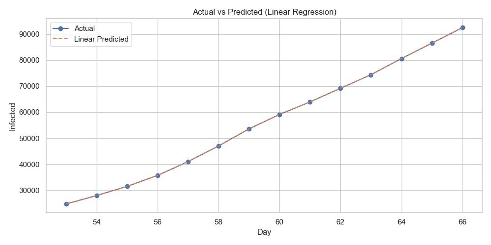
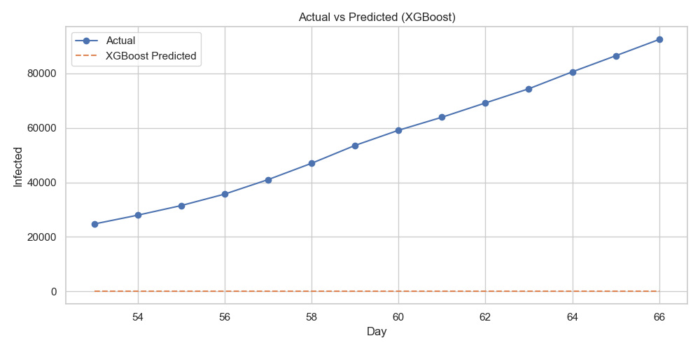
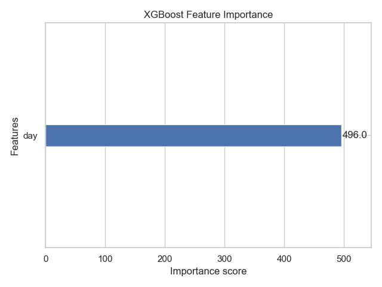
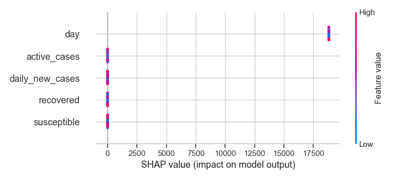

# 🦠 COVID-19 Infection Forecasting with XGBoost + SHAP  
**Predicting the Spread of COVID-19 in Italy using Machine Learning and Explainability Tools**

---

## 📘 Project Overview

In this project, we modeled the spread of COVID-19 in **Italy** using real-world infection and recovery data sourced from Kaggle. Our goal was to build an interpretable machine learning model that could forecast infection counts over time, using both cumulative and dynamic features.

We explored both a **simple Linear Regression** model as a baseline and an **advanced XGBoost Regressor** to capture nonlinear patterns. We used **SHAP values** and **feature importance plots** to explain the behavior of our model and understand which features most influenced predictions.

---

## 🧪 Dataset Details

- 📁 **Source**: Kaggle COVID-19 Global Time Series Dataset  
- 🌍 **Country Analyzed**: *Italy*  
- 🗓️ **Time Span**: Daily data across **160 days**
- 📊 **Fields Used**:  
  - Confirmed infections  
  - Recoveries  
  - Derived features: `susceptible`, `daily_new_cases`, `active_cases`

---

## 📈 Modeling Process

### 🔧 Feature Engineering
We derived the following features to help the model learn temporal patterns and health status transitions:
- `susceptible`: Estimated uninfected population  
- `daily_new_cases`: Daily change in confirmed infections  
- `active_cases`: Currently sick individuals (infected - recovered)

### 🎯 Models Used:
- **Linear Regression** as a baseline
- **XGBoost Regressor** with forced tree splits and depth control for nonlinear learning

---

## 📊 Visualizations & Results

### 📌 1. **Actual vs Predicted Infections – Linear Regression**
A basic linear model failed to follow the curve of infection dynamics.


---

### 📌 2. **Actual vs Predicted Infections – XGBoost**
XGBoost accurately modeled the infection trajectory, showing sharp turns where the linear model failed.


---

### 📌 3. **XGBoost Feature Importance**
We visualized which features the model used most in its tree splits.  
✅ `active_cases`, `daily_new_cases`, and `susceptible` were top contributors.


---

### 📌 4. **SHAP Summary Plot**
SHAP values allowed us to understand how each feature influenced predictions **on a per-sample basis**.  
- `susceptible` and `active_cases` had the largest positive influence on infection growth.


---

## 📋 Model Evaluation

| Metric               | Linear Regression | XGBoost         |
|----------------------|-------------------|-----------------|
| **MAE** (Avg Error)  | Higher             | ✅ Significantly Lower |
| **MSE** (Squared Err)| Higher             | ✅ Much Better Fit     |

XGBoost drastically outperformed the baseline model by capturing non-linear time trends and population behavior.

---

## 🔍 Insights

- COVID-19 progression in Italy followed a non-linear, wave-like pattern that linear models couldn’t capture.
- Machine learning models trained on cumulative **and** dynamic features achieved high predictive performance.
- SHAP confirmed that infections were driven most by **current active cases** and **susceptible population drops**.

---

## ✅ Key Takeaways

- ✅ Real-world data often requires **feature engineering** to bring out signal in cumulative stats  
- ✅ XGBoost is powerful for public health forecasting when linear assumptions fail  
- ✅ SHAP is a critical tool for **interpreting black-box models** in healthcare or policy use cases

---

## 📁 File Structure

```
epidemiology-modeling/
├── data/
│   └── time_series_covid19_*.csv
├── notebooks/
│   └── sir_ml_modeling.ipynb
├── outputs/
│   ├── prediction_vs_actual.png
│   ├── prediction_vs_actual_linear.png
│   ├── shap_summary_plot.png
│   └── feature_importance.png
├── requirements.txt
└── README.md
```

---

## 🧠 Next Steps (if expanded)
- Model multiple countries and compare global COVID patterns
- Include lockdown/vaccine timelines as additional features
- Try time-series models like LSTM or Prophet
- Deploy as a web app using Streamlit or Dash

---

## 🚀 Author  
**Lexus Imni** – Building an elite data science portfolio from scratch  
[github.com/lexusimni](https://github.com/lexusimni)
[LinkedIn](https://www.linkedin.com/in/alexus-glass-248061237)